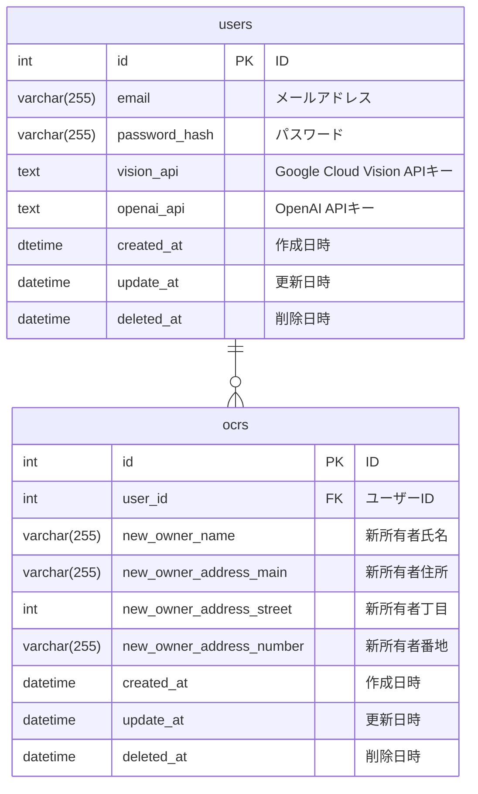

# CarDoc Reader
自動車の登録手続きに必要な書類をGoogle Cloud Vision APIのOCR機能で読み取り、OpenAIのAPIを使って形式を整えて、エクセルにダウンロードできるWebアプリケーションです。

## サービスのURL
https://cardocreader.com/login 

下記の情報でログインしてご利用いただけます。 
test1@example.com 
Test1234 

## 開発理由
私は現在、自動車の登録を専門とする行政書士事務所に事務員として勤務しています。 
お客様から預かった紙の書類を見て、データをパソコンに打ち込むという作業を日々行っていますが、とても非効率だと感じていました。 
そこで、このツールを使うことで大幅に作業時間の短縮、また会社が力を入れているDX化にも貢献ができると思いこのWebアプリを作成しました。  
今後は申請書類の印刷や請求書作成など一元管理できるツールにしていきたいと考えています。 

## 使用技術
Category | Technology Stack
-|-
バックエンド | Python, Flask
フロントエンド | HTML, CSS, JavaScript
データベース | MySQL
環境構築 | Docker
インフラ | AWS
API | OpenAI, Google Cloud Vision
etc. | Git, Github

## ER図

## 機能一覧
- ログイン
- アカウント新規作成
- 書類アップロード&OCR
- OCR一覧
- OCR編集
- アカウント編集

## 今後の展望
- フロントエンドの充実 
  必要最低限しか実装していないので、より使いやすいUIを目指す。
- CI/CDを導入 
- OCRできる書類の追加 
  現在は印鑑証明しかできませんが、車検証や車庫証明などもOCRできるようにする
